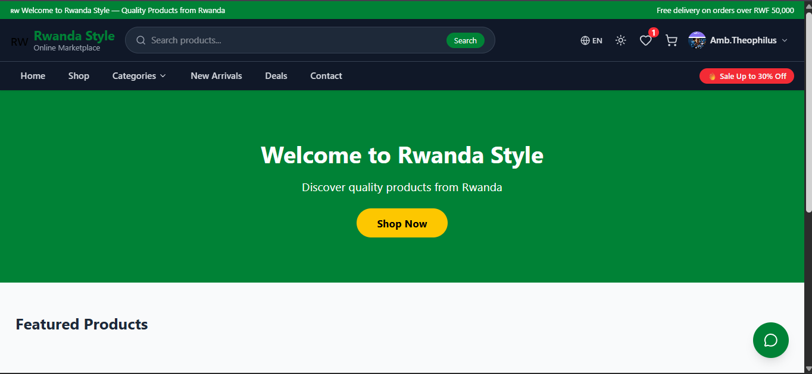
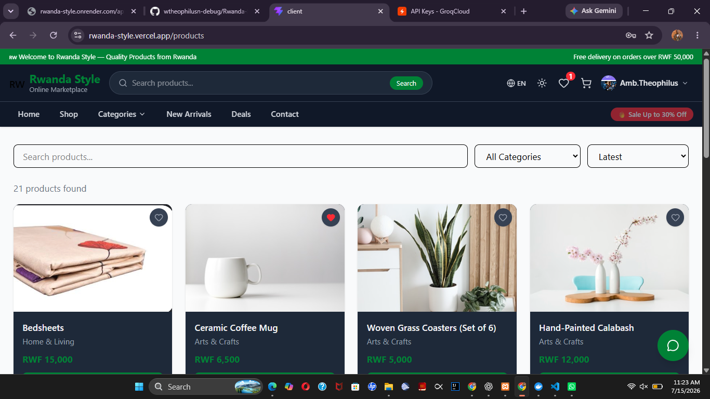
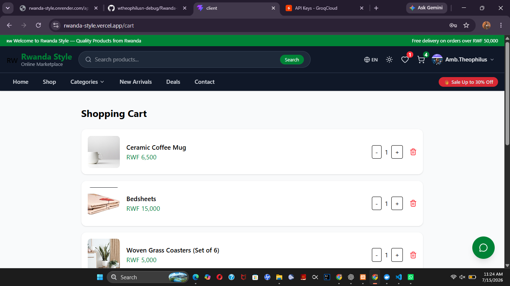
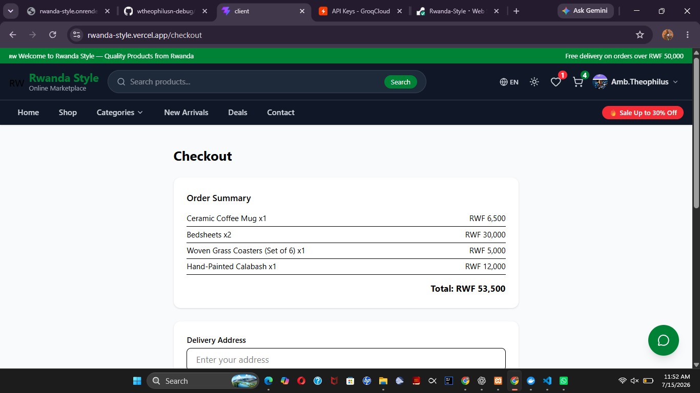

# EWA408510 – E-Commerce and Web Application
## Final Project Report

**Student Name:** Amb. Theophilus Nehemiah Wherdaigar 
**Course:** EWA408510 – E-Commerce and Web Application  
**Instructor:** Eric Maniraguha  
**Academic Year:** 2025–2026  
**Submission Date:** July 2026

---

## 1. Introduction

Rwanda Style is a full-stack, production-ready B2C e-commerce web application designed to help businesses sell authentic Rwandan products online. The platform provides a complete shopping experience — from product browsing and cart management to order placement and tracking — alongside a comprehensive admin panel for business management.

The application is live and accessible at:
- **Frontend:** https://rwanda-style.vercel.app
- **Backend API:** https://rwanda-style.onrender.com
- **GitHub Repository:** https://github.com/wtheophilusn-debug/Rwanda-Style

---

## 2. Problem Statement

Many local Rwandan businesses still rely on physical stores and informal social media channels to sell their products, limiting their reach and operational efficiency. There is a growing need for a dedicated, professional online marketplace that allows businesses to showcase products, manage inventory, process orders, and serve customers digitally — especially as Rwanda continues to advance its digital economy agenda.

---

## 3. Project Objectives

- Develop a responsive and professional e-commerce web application for the Rwandan market
- Implement full product management with categories, search, and filtering
- Provide a seamless shopping cart and checkout experience
- Build a secure authentication system with role-based access control
- Create a comprehensive admin dashboard for business management
- Deploy the application using modern DevOps practices including Docker, CI/CD, and cloud hosting
- Implement innovative features such as an AI-powered shopping assistant and analytics dashboard

---

## 4. System Features

### Customer Features
- Browse and search products with category and price filters
- Add products to cart and manage quantities
- Wishlist management with real-time count in navbar
- Secure checkout with delivery address and phone collection
- Order history and visual order tracking
- Product reviews and ratings
- Customer dashboard with spending charts and recommendations
- Saved delivery addresses and payment methods
- Notifications center
- Account settings and profile management

### Authentication
- User registration and login
- JWT-based authentication with 7-day token expiry
- Password hashing with bcrypt (12 salt rounds)
- Protected routes for authenticated users and admins

### Admin Features
- Dashboard overview with revenue stats and charts
- Product management — Add, Edit, Delete with Cloudinary image upload
- Order management with status updates and invoice download
- Category management
- Customer overview with spending data
- Analytics with revenue charts, order status breakdown, and top products
- Admin profile and password settings

### Innovation Features
- **AI Shopping Assistant** — Powered by Groq (LLaMA 3.3 70B), the chatbot answers product questions, recommends items, and navigates users to pages
- **Dark Mode** — Full dark theme toggle persisted in localStorage
- **Language Toggle** — English / Kinyarwanda (RW) language switching across the UI
- **Analytics Dashboard** — Revenue charts, order status pie chart, top products bar chart

---

## 5. Technologies Used

| Layer | Technology |
|---|---|
| Frontend | React 18, Vite, Tailwind CSS v4 |
| Backend | Node.js, Express.js v4 |
| Database | MongoDB Atlas |
| Authentication | JWT, bcrypt |
| Image Storage | Cloudinary |
| AI Assistant | Groq API (LLaMA 3.3 70B) |
| Charts | Recharts |
| Frontend Deployment | Vercel |
| Backend Deployment | Render |
| Containerization | Docker, Docker Compose |
| CI/CD | GitHub Actions |
| Version Control | Git, GitHub |

---

## 6. System Architecture

The application follows a standard three-tier architecture:

```
┌─────────────────────────────────────────────────────┐
│                   CLIENT (React)                     │
│         Hosted on Vercel — react-style.vercel.app    │
│  Pages: Home, Products, Cart, Checkout, Dashboard,   │
│         Admin Panel, AI Chat                         │
└─────────────────────┬───────────────────────────────┘
                      │ HTTPS REST API
┌─────────────────────▼───────────────────────────────┐
│               SERVER (Express.js)                    │
│         Hosted on Render — onrender.com              │
│  Routes: /auth /products /orders /categories         │
│          /wishlist /contact /ai                      │
│  Middleware: JWT Auth, Helmet, CORS, Multer          │
└──────────┬──────────────────────┬───────────────────┘
           │                      │
┌──────────▼──────────┐  ┌───────▼──────────────────┐
│   MongoDB Atlas     │  │      Cloudinary           │
│  Database Cluster   │  │   Image Storage CDN       │
│  AWS af-south-1     │  └──────────────────────────┘
└─────────────────────┘
```

**API Base URL:** `https://rwanda-style.onrender.com/api`

---

## 7. Database Design

The application uses MongoDB with the following collections:

### Users
```
_id, name, email, password (hashed), phone, role (customer/admin), avatar, createdAt
```

### Products
```
_id, name, description, price, image (Cloudinary URL), category (ref), stock,
reviews: [{ user (ref), rating, comment, createdAt }], createdAt
```

### Categories
```
_id, name, createdAt
```

### Orders
```
_id, user (ref), products: [{ product (ref), quantity, price }],
total, address, phone, status (pending/processing/shipped/delivered/cancelled), createdAt
```

### Wishlist
```
_id, user (ref), products: [ref → Product], updatedAt
```

**Relationships:**
- One User → Many Orders
- One User → One Wishlist
- One Order → Many Products
- One Product → One Category
- One Product → Many Reviews (embedded)

---

## 8. Screenshots

### Homepage


### Products Page


### Shopping Cart


### Checkout


### Admin Dashboard


### AI Chat Assistant


### Dark Mode


---

## 9. GitHub Repository

**URL:** https://github.com/wtheophilusn-debug/Rwanda-Style

The repository contains:
- Meaningful commit history documenting all development stages
- Separate `client/` and `server/` directories
- Complete `README.md` with setup instructions, API documentation, and deployment guide
- `.env.example` template for environment variables
- `.gitignore` excluding sensitive files
- `.github/workflows/ci.yml` for CI/CD automation

---

## 10. Deployment

### Frontend — Vercel
- Platform: Vercel
- URL: https://rwanda-style.vercel.app
- Build Command: `npm run build`
- Environment Variable: `VITE_API_URL=https://rwanda-style.onrender.com/api`
- Auto-deploys on every push to `main` branch

### Backend — Render
- Platform: Render
- URL: https://rwanda-style.onrender.com
- Start Command: `node index.js`
- Environment variables configured in Render dashboard

### Database — MongoDB Atlas
- Cluster: `rwanda-style-cluster`
- Region: AWS Cape Town (`af-south-1`)
- Database: `rwanda_style`

### Image Storage — Cloudinary
- All product and avatar images stored in Cloudinary CDN
- Folder: `rwanda-style/`

---

## 11. CI/CD Pipeline

A GitHub Actions CI/CD pipeline is configured at `.github/workflows/ci.yml`.

**Triggers:** Push or Pull Request to the `main` branch

**Pipeline Steps:**
1. Checkout code from repository
2. Setup Node.js v22
3. Install backend dependencies (`cd server && npm install`)
4. Install frontend dependencies (`cd client && npm install`)
5. Build frontend (`npm run build`)
6. Run backend tests

**Evidence:**


The pipeline ensures that every code push is automatically built and validated before deployment, maintaining code quality and catching errors early.

---

## 12. Docker Implementation

The application is fully containerized using Docker.

### Dockerfile
The `Dockerfile` builds the Node.js Express server image, installs dependencies, and exposes port 5000.

### docker-compose.yml
Docker Compose defines two services:
- `server` — Express API running on port `5000`
- `mongo` — MongoDB instance running on port `27017`

### Running with Docker
```bash
docker compose up --build
```

**Evidence:**


Docker ensures the application runs consistently across any environment, eliminating "works on my machine" issues.

---

## 13. Challenges Encountered

1. **Gemini API Key Issue** — Google AI Studio provided OAuth tokens (`AQ.` prefix) instead of standard API keys due to organizational restrictions. Resolved by switching to the Groq API which provided a standard API key compatible with backend integration.

2. **Render Cold Starts** — The free tier on Render spins down after inactivity, causing slow initial responses. This is a known limitation of free hosting tiers.

3. **Dark Mode with Tailwind v4** — Tailwind CSS v4 changed the dark mode configuration syntax. Required adding `@custom-variant dark` in `index.css` instead of the traditional `darkMode: 'class'` config.

4. **Admin Data Not Loading** — The JWT middleware lacked error handling, causing silent failures when tokens expired. Fixed by wrapping `jwt.verify` in a try/catch block.

5. **CORS Configuration** — Configuring CORS to allow both localhost development and the live Vercel domain required careful origin whitelisting.

---

## 14. Future Enhancements

1. **Mobile Money Payment Integration** — Integrate MTN Mobile Money and Airtel Money for local payment processing
2. **Real-Time Notifications** — Implement WebSocket-based live order status updates
3. **Progressive Web App (PWA)** — Add service workers for offline support and installability
4. **Multi-Vendor Marketplace** — Allow multiple sellers to register and manage their own storefronts
5. **SMS Notifications** — Send order confirmations via SMS using local Rwandan telecom APIs
6. **Product Recommendations** — Enhance the AI assistant with personalized product recommendations based on purchase history
7. **Inventory Alerts** — Automatic low-stock notifications for admin
8. **Delivery Tracking Map** — Real-time delivery tracking with map integration

---

## 15. Conclusion

Rwanda Style successfully demonstrates a complete, production-ready e-commerce platform built with modern web technologies. The application fulfills all functional requirements — product management, shopping cart, checkout, database integration, authentication, and admin management — while also implementing advanced DevOps practices including Docker containerization, GitHub Actions CI/CD, and cloud deployment on Vercel and Render.

The addition of innovative features such as an AI-powered shopping assistant (Groq LLaMA 3.3), dark mode, Kinyarwanda language support, and a comprehensive analytics dashboard positions Rwanda Style as a competitive and forward-thinking solution for the Rwandan digital commerce market.

This project has strengthened my understanding of full-stack web development, RESTful API design, database modeling, cloud deployment, and DevOps practices — skills that are directly applicable to real-world software engineering roles.

---

*Submitted by: Amb. Theophilus Nehemiah Wherdaigar*  
*EWA408510 — E-Commerce and Web Application*  
*Academic Year 2025–2026*
